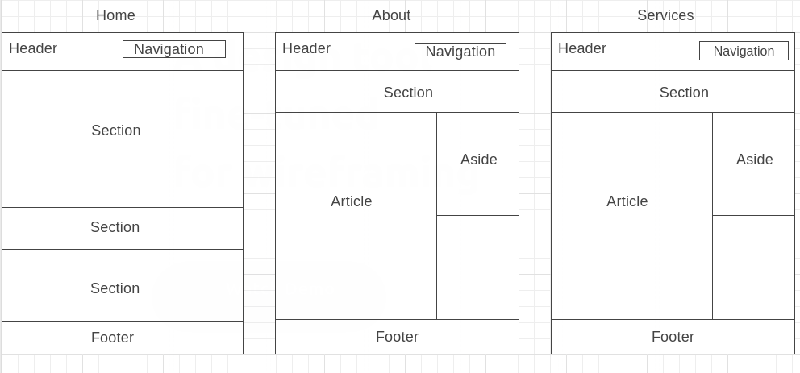

# Development Strategy

> `acme web design`

- The project acts as a tutorial for learning simple clean code HTML & CSS
- The project combines how to setting responsive mobile website
- The project is for learning how to write complete readme file and development strategy file

## Wireframe

<!-- include a wireframe for your project in this repository, and display it here -->
<!-- wireframe.cc is a good site for getting started with wireframes -->

## 0. Set-Up

__A User can see my initial repository and live demo__

### Repo

- Create a new repo generate from template
- Write initial, basic README
- Write initial, basic Development Strategy
- Add new wireframe
- Create new file of index.html, about.html, services.html, and styles.css
- Add assets: logo of services and background image
- Turn on GitHub Pages

## 1. User Story: title

As a user story, I want to know the name of the website

### Repo

1. This user story was developed on a brach called `title`
2. It was merged to `master` when the feature was finished.

### HTML

- A header element with a name of website
- A navigation bar with a name of its function
- A footer

### CSS

- Layout styling for the header, navigation bar, & footer
- Text styling for the name of website, navigation bar, and footer

## 2. User Story: Website Introduction

As a user story, I want to know more about website and its services

1. This user story was developed on a brach called `website-intro`
2. It was merged to `master` when the feature was finished.

### HTML

- A section of showcase
- A section of boxes

### CSS

- Styling for a section of boxes
- Styling for a section of showcase

## 3. User Story: Newsletter
As a user story, I want to be able to subscribe the mailing list using e-mail

1. This user story was developed on a brach called `newsletter`
2. It was merged to `master` when the feature was finished.

### HTML

A section of newsletter

### CSS

Styling for the section of newsletter

## 4. User Story: Page-About
As a user story, I want to know more about the provider of service and their work

1. This user story was developed on a brach called `about`
2. It was merged to `master` when the feature was finished.

### HTML

- An article of About Us
- An aside of What We Do

### CSS

- Styling for the article of About Us
- Styling for aside of What We Do

## 5. User Story: Page-Services
As a user story, I want to know about the type of services and its price

1. This user story was developed on a brach called `services`
2. It was merged to `master` when the feature was finished.

### HTML

- An article of Services

### CSS

Styling for an article of Services

## 6. User Story: Quote
As a user story, I want to be able to get a quote from the site

1. This user story was developed on a brach called `quote`
2. It was merged to `master` when the feature was finished.

### HTML

An aside of Get A Quote

### CSS

Styling for an aside of Get A Quote

## Finishing Touches

- Write final, complete README:
  - [makeareadme.com](https://www.makeareadme.com/)
  - [bulldogjob](https://bulldogjob.com/news/449-how-to-write-a-good-readme-for-your-github-project)
  - [meakaakka](https://medium.com/@meakaakka/a-beginners-guide-to-writing-a-kickass-readme-7ac01da88ab3)
- Validate code to check for any last mistakes
